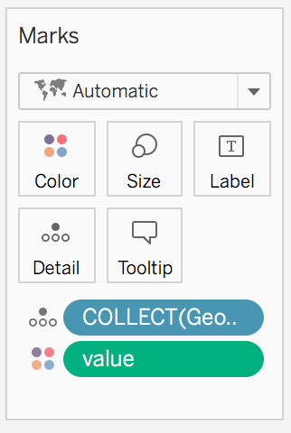

## Download your files

To download you files click [here](data.zip). The file is a compressed folder. Make sure you expand it.

## Connect to a file

1. Click on "Connect to Data".
2. Then, "To a File" -> "Text file".

This two step will connect your workbook to a .csv text file. But you also connect to an Excel file, a PDF or a spatial file.

3. Locate the file `ex01_gender.csv` and open it.
4. To connect to an additional file, next to "Connections" click on "Add" (and then redo steps 2. and 3.)

## Join two tables

Sometimes, your data is scattered in more than just one table. In this example, for each observation (i.e. person) we have `Gender` in one table and the `Weight` and `Height` in a different table. To *join* the information from the two tables, we need a column with a unique ID. In this example, that column is labelled, not surprisingly, `id`. 

After you connect to your files, Tableau will automagically join two or more table if it identifies a common unique ID column. You can check on which columns the tables have been joined (or change the join columns) by clicking on the symbol connecting the two tables.

[For more details, see the Tableau documentation](https://help.tableau.com/current/pro/desktop/en-us/joining_tables.htm)

## Visualise your data

### Visualise the count

If you want to count how many females and males you have in your data,

1. Go to your worksheet (probably called "Sheet 1").

You should now see you data on the left with a list of your "Dimensions" and "Measures". 

2. Drag-and-drop `Gender` in the "Columns" bar.
3. Drag-and-drop `Gender` in the "Rows" bar.
4. Click on the little triangle on the right of "Gender" in the "Rows" bar.
5. Select "Measure" -> "Count".

Not that exciting, we have 5k records for each `Gender`.

### Visualise the average

1. Remove the "CNT(Gender)" from the "Rows" bar by drag-and-dropping it somewhere else.
2. Drag-and-drop `Height` (or `Weight`) from below "Measures" in the "Rows" bar.

Automatically, Tableau will sum all the values. So you can see now what is the total height (or weight) calculated by summing all the heights (and weights) in the data. This is not very interesting. Let's instead calculate the average for male and females.

3. Click on the little triangle on the right of "Height" (or "Weight") in the "Rows" bar.
4. Select "Measure" -> "Average".

### Visualise the distribution of your measures

It's always important to have a sense of the distribution of a measure before you start analysing it.

1. Make sure your "Columns" and "Rows" bars are empty: drag-and-drop any content away.
2. Click on `Height` (or `Weight`) from below "Measures", on the left-hand side of the window.
3. Click on the histogram view on the right-hand side of the window.

4. Drag-and-drop `Gender` in the "Rows" bar.

Do you understan what you see?

### Export your view

To export the visualisation you have created you can

1. Click on "File" in the menu bar, then "Export as PowerPoint..." -> "Export".

## Geographic data

### Connect to the data

* `ex02_gdp-capita.xlsx` (connect to an "Excel file")
* `ex02_NUTS_RG_10M_2016_3857_LEVL_2.shp` (connect to a "Spatial file")

### Join the tables

Tableu will not be able to join the two tables. You will need to do it on your own.

1. Select `geo` on the left side of the "=" sign.
2. Select `NUTS_ID` on the right side of the "=" sign.
3. Close the "Join" windown

Your table should now be joined!

### Change the data type of a column

The column `value` was loaded as a string ("Abc"). We need to consider it as a number.

1. Click on "Abc" in the header of the "value" column.
2. Select "Number (whole)".

### Visualise the geographic data

Let's go to the "Sheet 1" tab.

1. Drag-and-drop `Geometry` from below "Measures" where you read "Drop field here".

You should now see the map of Europe.

Make sure that `value` from "Sheet 1" is below "Measures". If you find it below "Dimensions" you will need to Drag-and-drop it from "Dimensions" to "Measures".

2. Drag-and-drop `value` from below "Measures" to on the map.
3. In the "Marks" box change what is coloured in the map by clicking on the little triangle: from "Measure" -> "Sum" to "Dimensions". This because you don't want to see the sum of the value but the actual corresponding value for each region of the map. 

### Change the colors

1. Click on "Color".
2. Set the "Opacity" to `100%`.
3. Click on "Edit Colors" to change the colors.

### Filter the values

The contrast between the different regions is not very strong because there is an [outlier](https://en.wikipedia.org/wiki/Outlier). To remove the outlier from the visualisation
 

1. Drag-and-drop `value` from below "Measures" to where you read "Filters".
2. Click on "Next".
3. Move the slide to somewhere below 100,000.
4. Click "OK".

Now all the values above 100,000 have been removed!

